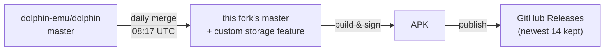

# Dolphin CS

**Dolphin, with your user data folder back in your hands on Android — rebuilt nightly.**

[**⬇ Download the latest nightly APK**](https://github.com/sayenah/Dolphin-CustomStorage/releases/latest)

---

## Why this fork exists

Google Play mandates [scoped storage](https://developer.android.com/about/versions/11/privacy/storage), so official Dolphin removed the ability to choose where your user data lives on Android. The old settings UI is still there — but tapping it just tells you Google won't allow it. And even back when it worked, it made you assign five or six folders one at a time.

**Dolphin CS restores the choice, as a single one-touch setting.** Pick where *all* of your Dolphin data lives — saves, states, configs, texture packs, the lot — and the app migrates everything there for you.

| Storage location | Where your data lives |
|---|---|
| **Scoped Storage** *(default)* | App-private storage, same as official Dolphin |
| **Internal Storage** | `/sdcard/dolphin-emu` — visible in any file manager |
| **SD Card** | `/storage/<card>/dolphin-emu` on a detected removable card |
| **Custom Location…** | Any folder you pick, via the system folder picker |

Everything else is untouched, upstream Dolphin.

## ✨ What you get

- 📁 **One-touch folder assignment** — a single setting, not six separate folder pickers
- 🚚 **Safe migration** — byte-verified copy with progress, free-space and writability preflight checks, and conflict handling when moving between locations
- 🔗 **No stale paths** — game folder, GBA BIOS, NAND root and other path settings are rewritten automatically after a move
- 🔐 **Android 11+ handled** — walks you through the *All files access* permission when a location needs it
- 🌙 **Fresh nightly builds** — every day this fork merges the latest [dolphin-emu/dolphin](https://github.com/dolphin-emu/dolphin) master and publishes a signed APK
- 🤝 **Installs alongside official Dolphin** — separate package (`com.sayenah.dolphinemu`), separate data; your official install is never touched

## 📲 Install

1. Grab the APK from the [**latest release**](https://github.com/sayenah/Dolphin-CustomStorage/releases/latest) and sideload it.
2. Open **Dolphin CS** → *Settings* → choose your **user data storage location**.
3. Let it migrate and restart. Done.

Every nightly is signed with the same key, so new builds install straight over the old one — your data and settings survive updates.

> [!NOTE]
> Because of the `MANAGE_EXTERNAL_STORAGE` permission, this app can never ship on the Play Store — sideloading is the only distribution channel, by design.

## 🌙 How the nightlies work

Fully automated: if upstream didn't change, no build runs; if a merge ever conflicts, nothing half-merged is published and an issue is opened instead. The [Releases](https://github.com/sayenah/Dolphin-CustomStorage/releases) page always has an installable, current build.

## 🙏 Credits

- **[Dolphin](https://github.com/dolphin-emu/dolphin)** — the emulator itself is entirely the Dolphin team's extraordinary work. See the [upstream README](https://github.com/dolphin-emu/dolphin#readme) for system requirements, documentation, and everything else Dolphin.
- **[JoeysRetroHandhelds/DolphinCS](https://github.com/JoeysRetroHandhelds/DolphinCS)** — the custom storage feature originates there; this fork ports it onto nightly-tracking master.

This is an unofficial community build, not affiliated with or endorsed by the Dolphin team. Please don't report issues with these builds to the official Dolphin project.

## 📜 License

GPLv2+ — same as upstream Dolphin. See [COPYING](COPYING).
